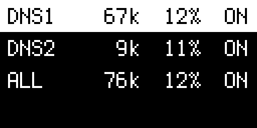
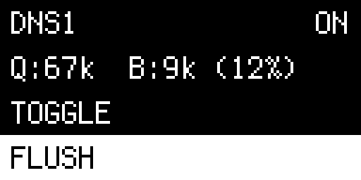
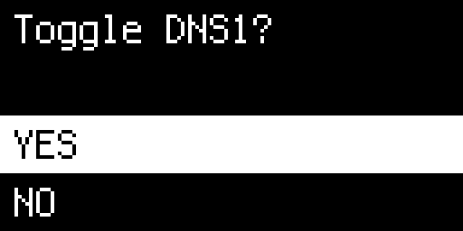

# AGDash

AdGuard Home dashboard for NanoPi NEO2 with NanoHat OLED display.

## Screenshots

| Home                              | Detail                                | Confirm                                 |
| --------------------------------- | ------------------------------------- | --------------------------------------- |
|  |  |  |

## Hardware

- **Board**: [NanoPi NEO2](https://wiki.friendlyelec.com/wiki/index.php/NanoPi_NEO2) running Armbian
- **Display**: NanoHat OLED - 128x64 SSD1306 on I2C
- **Buttons**: 3 GPIO buttons (K1, K2, K3)

## Features

- Monitor multiple AdGuard Home instances
- View query counts and block percentages
- Toggle protection on/off with confirmation
- Flush DNS cache (useful after adding new DNS records)
- 2-second splash screen on boot

## Navigation

- **K1**: Navigate up
- **K2**: Select / drill in
- **K3**: Navigate down

### Screens

**Home** - Overview of all DNS instances:

```
DNS1    67k  12%  ON
DNS2     9k  11%  ON
ALL     76k  12%  ON
```

**Detail** - Selected instance stats with options:

```
DNS1              ON
Q:67k  B:8k (12%)
TOGGLE / FLUSH
< BACK
```

**Confirm** - Yes/No before toggling:

```
Toggle DNS1?

YES
NO
```

## Setup

### Development (Mac)

```bash
uv sync
make run
```

In simulated mode, the display renders as ASCII in terminal.
Use keyboard: `1`=K1, `2`=K2, `3`=K3, `q`=quit

### Deployment (NanoPi)

1. Copy `config/config.yaml.example` to `config/config.yaml` and configure
2. Initial setup:
   ```bash
   make setup
   ```
3. Deploy updates:
   ```bash
   make deploy
   ```

### Configuration

```yaml
adguard:
  - name: "DNS1"
    url: "https://dns1.example.com"
    username: "admin"
    password: "your-password"
  - name: "DNS2"
    url: "https://dns2.example.com"
    username: "admin"
    password: "your-password"
```

## Makefile Commands

| Command        | Description                          |
| -------------- | ------------------------------------ |
| `make run`     | Run locally in simulated mode        |
| `make deploy`  | Deploy to NanoPi and restart service |
| `make setup`   | Initial NanoPi setup                 |
| `make logs`    | Tail service logs                    |
| `make status`  | Check service status                 |
| `make restart` | Restart the service                  |
| `make ssh`     | SSH to the device                    |

## Project Structure

```
agdash/
├── src/agdash/
│   ├── main.py           # Entry point
│   ├── app.py            # Main app loop
│   ├── hardware/
│   │   ├── display.py    # OLED display wrapper
│   │   └── buttons.py    # GPIO button handling
│   ├── ui/screens/
│   │   └── adguard.py    # AdGuard screen
│   └── services/
│       ├── config.py     # Configuration loading
│       └── adguard.py    # AdGuard Home API client
├── assets/fonts/         # Display fonts
├── config/
│   └── config.yaml.example
├── docs/                  # Screenshots
├── pyproject.toml
├── Makefile
├── agdash.service
└── README.md
```

## Dependencies

- `luma.oled` - OLED display driver
- `OPi.GPIO` - GPIO for NanoPi (nanopi extra)
- `pillow` - Image processing
- `requests` - HTTP client for AdGuard API
- `pyyaml` - Configuration parsing

## License

MIT
